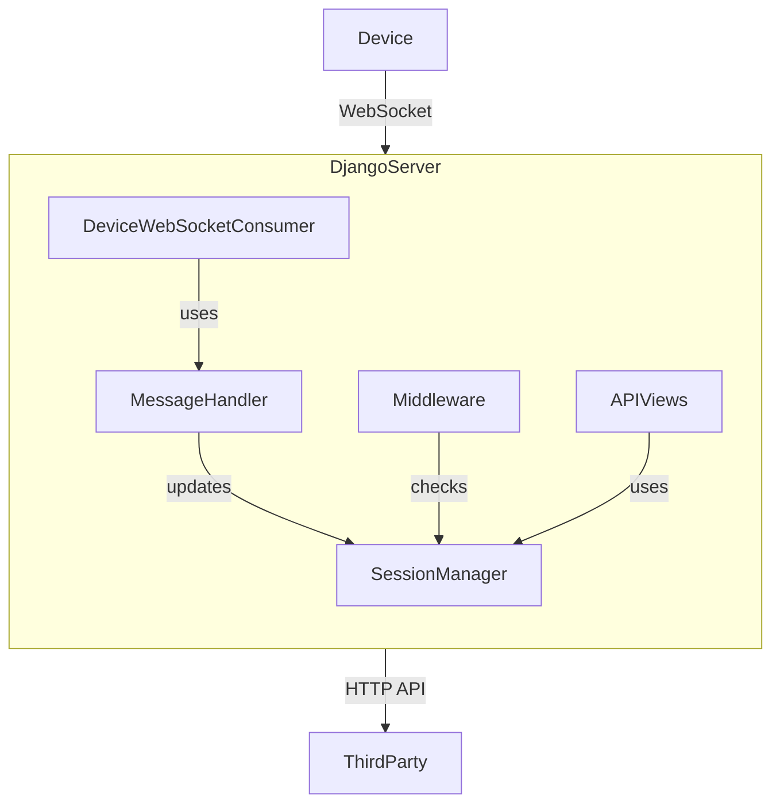

# Time Entry Handler Middleware

## Overview

This project is a **WebSocket API connection management service** for Shenxing Series Panel Devices.  
It allows devices to connect via WebSocket, authenticate, and enables third-party services to communicate with those devices through HTTP APIs.

## Architecture

- **Devices** connect to the server via WebSocket for authentication and session management.
- **Third-party services** interact with devices through HTTP APIs, provided the device is online and authenticated.
- **Session management** ensures only authenticated and online devices can be accessed via the API.

## Flow Diagram



## Main Features

- Device authentication using a random challenge (random number).
- WebSocket-based device communication.
- HTTP API for third-party services to check device status and interact with devices.
- Middleware for token-based or signature-based authentication for HTTP APIs.

## Project Structure

```
time-entry-handler-middleware/
  ├── device/
  │   ├── consumers.py      # WebSocket consumer for device connections
  │   ├── message.py        # Handles device messages and authentication
  │   ├── middleware.py     # Middleware for API authentication and device session checks
  │   ├── session.py        # Device session management
  │   ├── protocol.py       # Protocol definitions for device communication
  │   ├── constants.py      # API path and protocol constants
  │   ├── views.py          # API views (device status, etc.)
  │   └── ...
  ├── sxdm_py/
  │   ├── settings.py       # Django settings
  │   ├── urls.py           # Project URL routing
  │   ├── asgi.py           # ASGI config for WebSocket support
  │   └── ...
  ├── manage.py
  └── requirements.txt
```

## How to Run

### 1. **Clone the Repository**

```sh
git clone <your-repo-url>
cd time-entry-handler-middleware
```

### 2. **Create and Activate a Virtual Environment**

```sh
python -m venv venv
venv\Scripts\activate  # On Windows
# or
source venv/bin/activate  # On Linux/Mac
```

### 3. **Install Dependencies**

```sh
pip install -r requirements.txt
```

### 4. **Apply Migrations**

```sh
python manage.py migrate
```

### 5. **Run the Development Server**

```sh
python manage.py runserver
```

### 6. **Run WebSocket Server (if using Channels)**

If you want to use WebSocket features, make sure Django Channels is installed and run the ASGI server:

```sh
daphne sxdm_py.asgi:application
# or, for development:
python manage.py runserver
```

## API Usage

### Device Authentication Flow

1. **Device connects via WebSocket** to `/ws/api/websocket/`.
2. **Device requests a random value** via `/api/auth/random` (WebSocket message).
3. **Device sends login request** via `/api/auth/login` (WebSocket message) with the random value and password.

### Third-Party HTTP API

- **Headers required:**
  - `sxdmSn`: Device serial number (required)
  - `sxdmToken`: Token for authentication (if enabled in settings)

- **Example: Check Device Status**
  - Endpoint: `/api/device/status/<sn>/`
  - Method: `GET`
  - Returns: Device online status and last heartbeat time

## Configuration

- **Token Authentication:**  
  Set `ACCESS_AUTH_CHECK_TYPE` and `ACCESS_AUTH_CHECK_TOKEN` in `sxdm_py/settings.py` to enable/disable and configure token authentication for HTTP APIs.

## Notes

- The endpoint `/api/auth/login/challenge` is **not implemented** by default.
- Only `/api/auth/random` and `/api/auth/login` are supported for device authentication.
- You can extend the project by adding new API endpoints as needed.

---

**For more details, see the code comments and each module's docstrings. If you need help extending the project or have questions about the API, feel free to ask!**