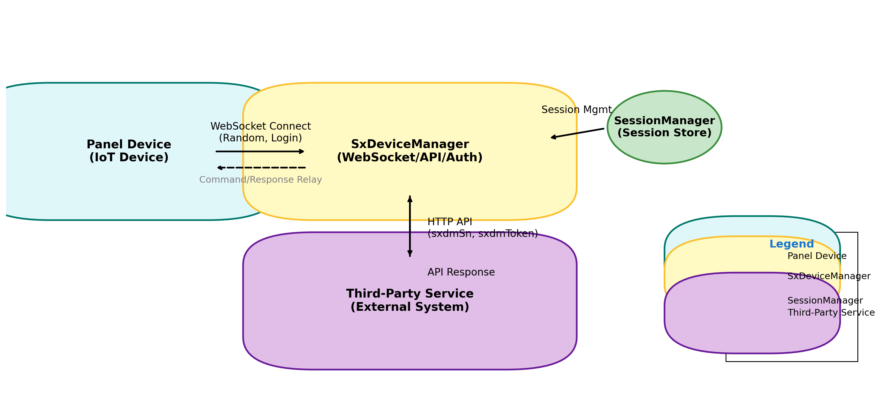

# 神行系列面板机WebSocket API链接管理服务

## 架构示意图


 说明
1. 面板机先通过WS与SxDeviceManager服务进行连接
2. 设备连接之后，通过接口文档中的【获取登录随机数】、【设备请求登录】两个接口进行设备鉴权，鉴权通过后，SxDeviceManager通过SessionManager保留与设备之间建立的连接Session
3. 第三方服务通过http接口调用访问SxDeviceManager，即可与对应的device进行通讯

## 第三方平台调用说明
> 第三方平台调用接口访问设备，基本可参考设备提供的API进行调用。除此之外，需要进行以下http header的设置。

1. 在http header中添加header[sxdmSn]，用于标明该api调用是具体访问哪个设备的
2. 根据SxDeviceManager服务是否对第三方服务http调用是否鉴权，（具体可设置application.properties中的access.auth.check.type配置），需要添加不同的header
  2.1 如果采用不鉴权，则不需要增加其他字段
  2.2 如果采用简单token鉴权，则需要额外增加http header[sxdmToken]字段，该字段的值，需要和application.properties中的access.auth.check.token字段的值一致，否则调用失败
  2.3 【推荐】用户可根据自己的安全需要，扩展其他更严格的鉴权方式，具体可参考和修改AccessAuthCheckFilter 类的代码

## 设备鉴权
> 目前SxDeviceManager服务队设备仅做了简单的随机数鉴权方式，建议客户重写SxDeviceServiceImpl类的checkClientLogin方法，采用更严格的设备鉴权方式【推荐

## Django REST Framework Clone

### Setup

1. Create and activate a virtual environment:
   ```sh
   python -m venv venv
   venv\Scripts\activate  # On Windows
   # or
   source venv/bin/activate  # On Linux/Mac
   ```
2. Install dependencies:
   ```sh
   pip install django djangorestframework
   ```
3. Run migrations:
   ```sh
   python manage.py migrate
   ```
4. Start the server:
   ```sh
   python manage.py runserver
   ```

### API Endpoints

- `GET /openapi/manager/status/` — List all online device statuses
- `GET /openapi/manager/status/<sn>/` — Get status for a specific device by serial number